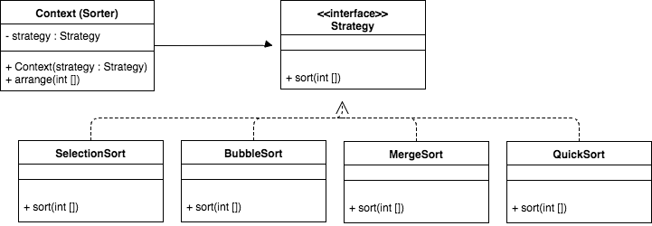

# Práctica Patrones de Diseño

**Autor:** Gabriel Muñumel

---

## Patrón de Diseño Strategy

El patrón de diseño _Strategy_ es un patrón de comportamiento que permite seleccionar un algoritmo 
en tiempo de ejecución. Su intención es facilitar el *intercambio* de un algoritmo dependiendo del tipo
de datos, su origen o otro criterio. 

A continuación se da un resumen de su composición:
* **Algoritmos** (estrategias) que son seleccionadas en tiempo de ejecución.
* Una **Estrategia** es dinámicamente seleccionada por el cliente (un usuario o 
un programa que lo consuma), o su contexto. 
* La clase controlador es llamada usualmente **Contexto**.
* El **Contexto** está al tanto de los **Algoritmos** y cada **Algoritmo** es considerado una **Estrategia**. 
* El **Contexto** es responsable por manejar los datos durante la interacción con el cliente.

## Explicación del caso práctico

El caso que se implementó es un algoritmo de ordenación en donde se puede utilizar el
tipo de ordenación en tiempo de ejecución. Para ello se tienen 4 algoritmos: `BubbleSort`, `SelectionSort`,
`MergeSort` y `QuickSort`. Cada uno de ellos implementa un método `sort` que es definido en la interface
`Strategy`. Es el contexto `Context` sabiendo de las estrategias de `Strategy` el que delega su ejecución en él. Por último, el `Context` comunica el resultado a un programa cliente o en mi caso solo ejecuta con el método `arrange`. 

El patrón _Strategy_ permite mucha flexibilidad a la hora de la ejecución, de forma que si el cliente desea
ejecutar un algoritmo de ordenación dependiendo de algún criterio se puede hacer adaptar sin mayores 
inconvenientes. La mantenibilidad se ve favorablemente impactada dado que si en el futuro se desea 
agregar un nuevo algoritmo de ordenación solo se debe crear su clase que implemente el método `sort` y 
utilizarla como otra estrategia mas. La limpieza en el código también es mejorada dado que no se requiere
crear un gran bloque `if-else` para hacer una selección del algoritmo de ordenación sino que dependiendo de 
la lógica del negocio se llama.   

El diagrama UML para el caso práctico es:

Fuentes:
* [https://alvinalexander.com/java/java-strategy-design-pattern-in-java](https://alvinalexander.com/java/java-strategy-design-pattern-in-java)
* [http://www.java67.com/2014/12/strategy-pattern-in-java-with-example.html](http://www.java67.com/2014/12/strategy-pattern-in-java-with-example.html)
* [https://en.wikipedia.org/wiki/Strategy_pattern](https://en.wikipedia.org/wiki/Strategy_pattern)

